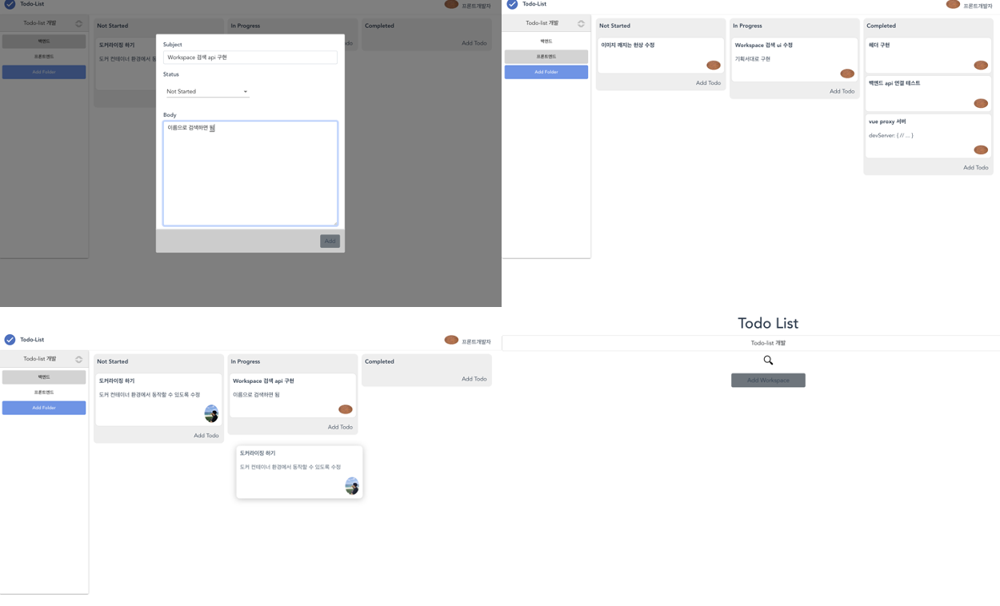

# Todo-list
Todo-list 는 할일을 관리할 수 있는 앱입니다.
Workspace 단위로 다른 사용자들과 함께 작업할 수 있습니다.

서버 Spring mvc 구조를 빌려와 레이어 구성

Backend : golang, echo
Database: mysql
Frontend : javascript, vue
Etc : git

## 주요 기능
- jwt, cookie 를 이용한 인증처리
- workspace 생성, 검색
- workspace 내에 폴더를 생성하고 폴더 안에 Todo 아이템을 생성
- 드래그 앤 드롭을 통한 todo status 관리
- 사용자 프로필 사진 변경
---
### 페이지 이미지
